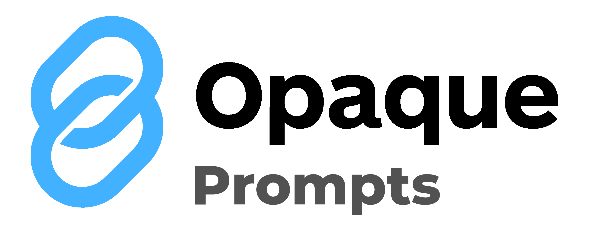

<div align="center">
  
</div>

---

[](https://discord.gg/mVuCfxudrD)
[](https://badge.fury.io/py/opaqueprompts)

OpaquePrompts enables applications to leverage the power of language models while preserving user privacy. This repo contains the OpaquePrompts Python library, which provides a simple interface for interacting with the OpaquePrompts Service. More information about OpaquePrompts can be found in the [documentation](https://opaqueprompts.readthedocs.io/).

**API Stability:** This package is still in development. As such, its API may
change until it is sufficiently mature.

## Installation

The OpaquePrompts Python library can be installed via pip:

```bash
pip install opaqueprompts
```

## Documentation
For a quickstart, technical overview, and API reference, see the [OpaquePrompts documentation](https://opaqueprompts.readthedocs.io/).

## Contact
To contact us, join our [Discord server](https://discord.gg/mVuCfxudrD) or email us at [opaqueprompts@opaque.co](mailto:opaqueprompts@opaque.co).
